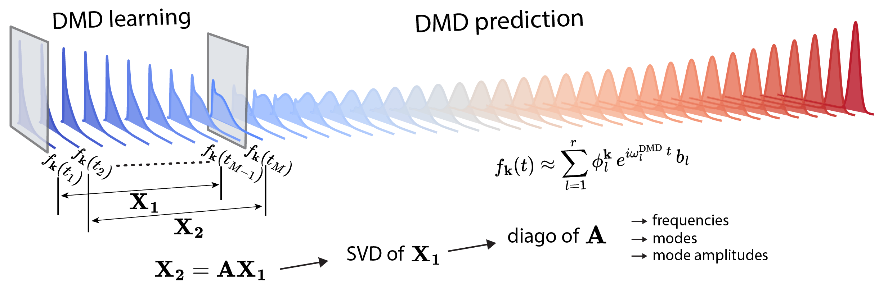

# Dynamic Mode Decomposition

A Python implementation of the standard and high-order dynamic mode decomposition, DMD[1-3] and HODMD[4]. The most time consuming part, the singular value decomposition (SVD) is performed using numpy. Loops over the space are vectorized.



## Installation

1. [Recommended] Create a Python environment, e.g. Conda environment:

```bash
conda create -n dmd pip numpy scipy
conda activate dmd
```

2. Clone the GitHub repository:

```bash
git clone git@github.com:imaliyov/dmd.git
```

3. Navigate to the `dmd` folder and install the package:

```bash
cd dmd
pip install .
```

## Examples

Navigate to the `examples` folder and run one of the example files:

```bash
cd examples
./example<...>.py
```

## References

1. S. L Brunton and J. N. Kutz, *Data-Driven Science and Engineering: Machine Learning, Dynamical Systems, and Control*, Cambridge University Press, 2022. [DOI: 10.1017/9781108380690](https://doi.org/10.1017/9781108380690)

2. J. Yin, Y. Chan, F. H. da Jornada, D. Y. Qiu, C. Yang, and S. G. Louie, *Analyzing and predicting non-equilibrium many-body dynamics via dynamic mode decomposition*,  J. Comput. Phys., **477**, 2023, pp. 111909. [DOI: 10.1016/j.jcp.2023.111909](https://doi.org/10.1016/j.jcp.2023.111909)

3. I. Maliyov, J. Yin, J. Yao, C. Yang, and M. Bernardi, *Dynamic mode decomposition of nonequilibrium electron-phonon dynamics: accelerating the first-principles real-time Boltzmann equation*, [arXiv: 2311.07520](https://arxiv.org/abs/2311.07520)

4. S. Le Clainche and J. M. Vega, *Higher Order Dynamic Mode Decomposition*, *SIAM Journal on Applied Dynamical Systems*, **16**, no. 2, pp. 882–925, 2017. [DOI: 10.1137/15M1054924](https://doi.org/10.1137/15M1054924)


